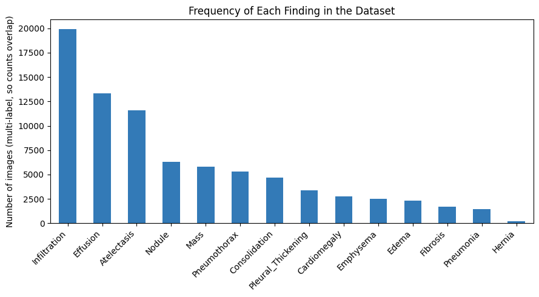
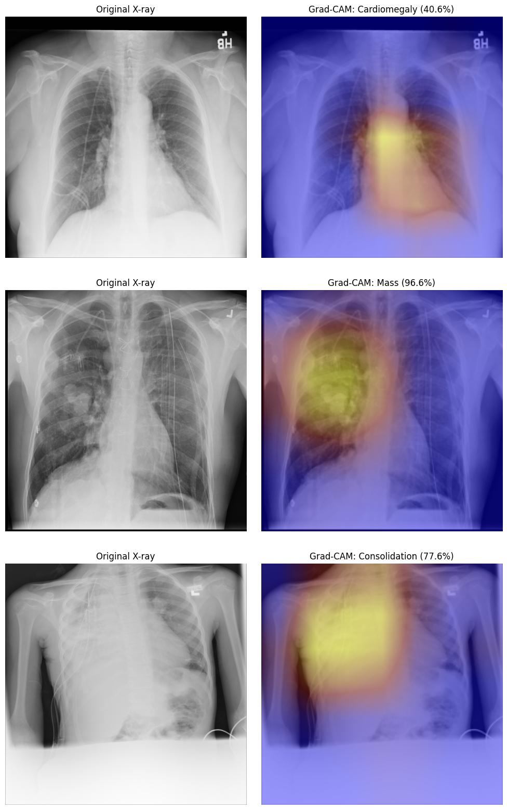
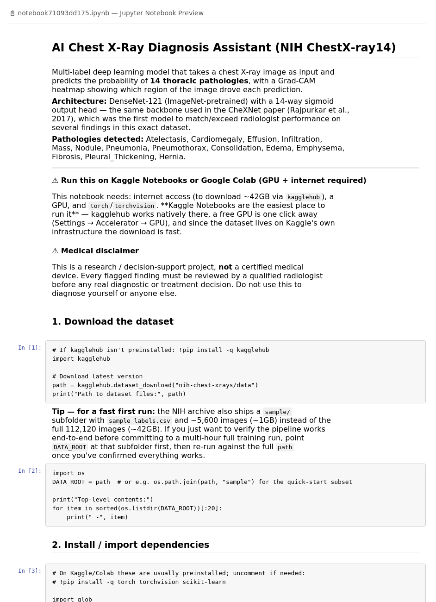

# AI Chest X-Ray Diagnosis Assistant

A deep learning model that looks at a chest X-ray and predicts the probability of **14 thoracic pathologies** (Atelectasis, Cardiomegaly, Effusion, Infiltration, Mass, Nodule, Pneumonia, Pneumothorax, Consolidation, Edema, Emphysema, Fibrosis, Pleural Thickening, Hernia), plus a heatmap showing *where* in the image it looked.

Built on the **NIH ChestX-ray14** dataset, using the same backbone as the CheXNet paper (Rajpurkar et al., 2017).

> ⚠️ Research / educational demo only — **not** a diagnostic tool. Never use this to make real medical decisions.

---

## 🧠 ML Techniques Used (Explained Simply)

### 1. Transfer Learning
Instead of training a model from scratch (which needs millions of images), we start with **DenseNet-121**, a model already trained on 1.2 million everyday photos (ImageNet). It already knows how to detect edges, shapes, and textures — we just teach it to apply that skill to X-rays. This makes training much faster and more accurate with limited data.

### 2. Convolutional Neural Network (CNN) — DenseNet-121
A CNN is a type of neural network built to "see" images. It scans the image in small patches, learning to detect simple patterns first (edges, curves) and combining them into complex ones (organs, abnormalities) in deeper layers. DenseNet specifically connects every layer to every other layer, which helps information and gradients flow better through a deep network.

### 3. Multi-Label Classification
A normal classifier picks **one** answer (e.g., "cat" or "dog"). Here, a single X-ray can show **several** conditions at once (e.g., both Effusion and Infiltration), so the model outputs 14 independent yes/no probabilities — one per pathology — instead of a single label.

### 4. Sigmoid Activation
For multi-label problems# AI Chest X-Ray Diagnosis Assistant

A deep learning system that analyzes chest X-ray images and predicts the probability of **14 thoracic pathologies**, with a visual heatmap explaining *why* the model made each prediction.

---

## 1. Project Description

This project builds an AI-powered diagnostic assistant that takes a chest X-ray image as input and outputs the probability of 14 different thoracic diseases: Atelectasis, Cardiomegaly, Effusion, Infiltration, Mass, Nodule, Pneumonia, Pneumothorax, Consolidation, Edema, Emphysema, Fibrosis, Pleural Thickening, and Hernia.

It is built on the **NIH ChestX-ray14 dataset** (112,120 X-ray images from over 30,000 patients) and uses **DenseNet-121**, the same backbone used in the well-known CheXNet research paper (Rajpurkar et al., 2017), which was the first model to match or exceed radiologist-level performance on several findings in this dataset.

Beyond just predicting probabilities, the project also generates **Grad-CAM heatmaps** that visually highlight which part of the X-ray influenced each prediction — making the model's decisions interpretable rather than a "black box."

> ⚠️ This is a research/educational project only — **not** a certified diagnostic tool. It is not a substitute for review by a qualified radiologist.

---

## 2. Objective

- Build a multi-label image classifier that can detect **multiple co-occurring diseases** in a single chest X-ray (not just one).
- Achieve competitive diagnostic performance (benchmarked against the published CheXNet mean AUC of ~0.84).
- Handle the dataset's severe **class imbalance** (some diseases appear in <1% of images, others in ~18%) without the model defaulting to "always predict healthy."
- Make predictions **explainable** using Grad-CAM, so a clinician could sanity-check what the model is "looking at."
- Provide an easy way to run the trained model on new, unseen X-ray images.

---

## 3. Process

The project follows a standard end-to-end deep learning pipeline:

1. **Download the dataset** — NIH ChestX-ray14 images and labels via `kagglehub`.
2. **Prepare the data** — parse `Data_Entry_2017.csv`, convert disease labels into multi-hot vectors, and apply the dataset's official **patient-level** train/validation/test split (to prevent the same patient's scans from leaking across splits).
3. **Explore the data** — visualize how frequently each disease appears to understand class imbalance.
4. **Build the data pipeline** — resize, normalize, and augment images (random flips/rotations) for training.
5. **Define the model** — DenseNet-121 pretrained on ImageNet, with its final layer replaced by a 14-way sigmoid output head.
6. **Train the model** — using a class-weighted loss function to counter imbalance, the AdamW optimizer, and a learning-rate scheduler; save the best checkpoint based on validation AUC.
7. **Evaluate on the test set** — compute AUC, precision, recall, F1-score per disease.
8. **Generate Grad-CAM explanations** — visualize which image regions drove each prediction.
9. **Run inference** — test the model on sample X-rays and on custom user-provided images.

---

## 4. Tools Used

| Category | Tool / Library |
|---|---|
| Language | Python |
| Deep Learning Framework | PyTorch, torchvision |
| Pretrained Model | DenseNet-121 (ImageNet weights) |
| Data Handling | pandas, NumPy |
| Dataset Access | kagglehub |
| Image Processing | PIL (Pillow) |
| Evaluation Metrics | scikit-learn (`roc_auc_score`, `precision_recall_fscore_support`) |
| Visualization | Matplotlib |
| Explainability | Custom Grad-CAM implementation |
| Compute Environment | Kaggle Notebooks / Google Colab (GPU) |

---

## 5. Analysis / Procedure (Explained with Screenshots)

### Step 1 — Understanding the data
The dataset is heavily imbalanced — some conditions are common, others extremely rare. This chart shows how many images contain each finding:

This imbalance is the reason the training step uses a **weighted loss function** instead of plain binary cross-entropy — without it, the model would learn to just predict "healthy" for rare diseases and still score deceptively well.

### Step 2 — Model architecture
DenseNet-121 was chosen because its "dense connections" (every layer connects to every later layer) help it learn efficiently even without a huge amount of task-specific data — helpful since medical imaging datasets are much smaller than general datasets like ImageNet. The final classification layer was swapped out for a 14-output sigmoid layer, since a single X-ray can show multiple diseases at once.

### Step 3 — Training
The model was trained for 10 epochs with `BCEWithLogitsLoss` (weighted), `AdamW`, and a learning-rate scheduler that reduces the rate when validation performance plateaus. Validation mean AUC improved steadily, peaking at epoch 9.

### Step 4 — Explaining predictions with Grad-CAM
For any prediction, Grad-CAM shows exactly where in the X-ray the model focused. Below are three real test images with their top predicted finding and the corresponding heatmap:

This step matters clinically: a high probability score alone isn't trustworthy without knowing whether the model is actually looking at the relevant anatomy (e.g., the heart border for Cardiomegaly) rather than an unrelated artifact like text or a pacemaker wire.

### Preview of the full notebook

---

## 6. Outcomes

Results from the actual 10-epoch training run on the full dataset:

**Training progress:**

| Epoch | Train Loss | Val Mean AUC |
|-------|-----------|--------------|
| 1     | 1.1259    | 0.7856       |
| 3     | 0.9805    | 0.8094       |
| 5     | 0.9222    | 0.8272       |
| 9     | 0.8156    | **0.8308 (best)** |
| 10    | 0.7806    | 0.8178       |

**Final test set: mean AUC = 0.8023**

| Pathology | AUC | Pathology | AUC |
|---|---|---|---|
| Hernia | 0.925 | Effusion | 0.817 |
| Emphysema | 0.902 | Fibrosis | 0.814 |
| Cardiomegaly | 0.884 | Mass | 0.814 |
| Pneumothorax | 0.852 | Pleural Thickening | 0.761 |
| Edema | 0.841 | Atelectasis | 0.757 |
| Nodule | 0.745 | Consolidation | 0.742 |
| Pneumonia | 0.697 | Infiltration | 0.680 |

**Accuracy at 0.5 threshold:** mean per-label accuracy **69.3%**, exact-match accuracy (all 14 correct simultaneously) **5.3%** — expected to be low since it requires every one of the 14 labels to match at once.

This result lands close to the published CheXNet benchmark (mean AUC ≈ 0.84) despite only 10 epochs of training. The model performed best on Hernia, Emphysema, and Cardiomegaly, and struggled most with Infiltration and Pneumonia — both notoriously subtle findings even for human radiologists.

---

## 7. Learnings and Difficulties

**Learnings:**
- Transfer learning drastically reduces the data and compute needed to reach strong performance on a specialized medical imaging task.
- Multi-label problems require a completely different setup (sigmoid + per-class loss weighting) than standard single-label classification.
- AUC is a more reliable metric than accuracy for imbalanced, multi-label problems, since accuracy alone can be misleadingly high.
- Explainability (Grad-CAM) is not optional in medical AI — a probability score without visual justification isn't clinically trustworthy.

**Difficulties encountered:**
- **Severe class imbalance** — rare conditions like Hernia (under 1% of images) required careful loss weighting to avoid being ignored by the model.
- **Patient-level data leakage risk** — since the same patient can appear multiple times in the dataset, a naive random split could leak information between train and test sets, inflating apparent performance. This required using the dataset's official patient-level split instead of a simple random split.
- **Compute and dataset size** — the full dataset is ~42GB and each training epoch took over 20 minutes on GPU, making iteration slow; a smaller `sample/` subset was used for quick pipeline testing before full runs.
- **Precision on rare classes** — even with weighting, precision remained low for the rarest classes (e.g., Pneumonia precision ~3.8%), showing that class imbalance is only partially solved by loss weighting alone.
- **Grad-CAM implementation detail** — DenseNet's in-place ReLU operation conflicted with standard backward hooks, requiring a workaround using a cloned activation tensor.

---

## 8. Future Aspects

- Try alternative backbones such as **EfficientNet** or a **Vision Transformer (ViT)** and compare AUC scores.
- Add **test-time augmentation** for more stable, robust predictions.
- Tune **per-class decision thresholds** instead of a single global 0.5 cutoff, optimized on a validation set.
- Train for the full recommended 15–20 epochs on the complete dataset to more closely match published CheXNet benchmarks.
- Validate the model against an **external, radiologist-labeled test set** before considering any real-world or clinical use.
- Calibrate output probabilities so predicted confidence better reflects true likelihood.
- Explore ensembling CNN and Transformer-based models, a direction shown in recent research to improve multi-label chest X-ray classification.

---

## ⚙️ Requirements

- GPU (recommended: Kaggle Notebooks or Google Colab)
- Python packages: `torch`, `torchvision`, `scikit-learn`, `pandas`, `numpy`, `matplotlib`, `kagglehub`, `Pillow`

## 🚀 Quick Start

1. Open the notebook in **Kaggle Notebooks** or **Google Colab** (GPU + internet required).
2. Run the cells top to bottom.
3. For a fast first run, use the dataset's `sample/` subfolder (~1GB, ~5,600 images) instead of the full ~42GB dataset.
4. Increase `EPOCHS` once you've confirmed the pipeline works end-to-end.

## ⚠️ Disclaimer

This project is for **research and educational purposes only**. It is not a certified medical device and must not be used for real clinical diagnosis. Any real-world use should involve review by a qualified radiologist.
